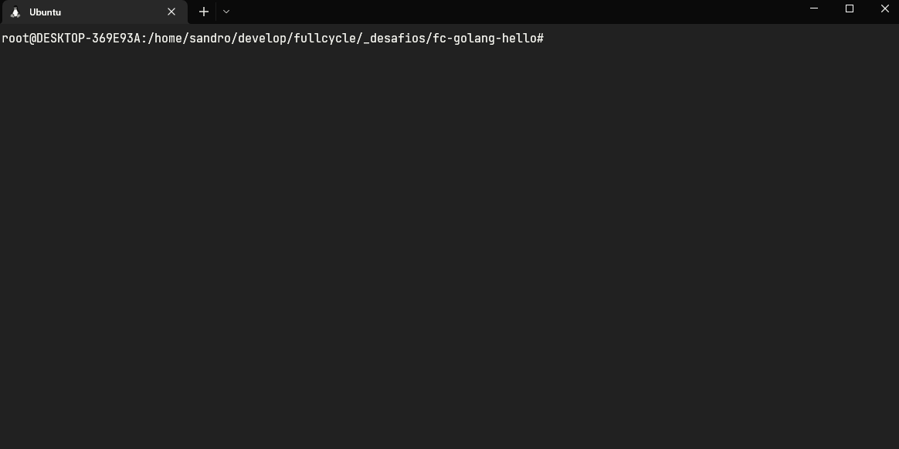

<!-- Please update value in the {}  -->

<h1 align="center">sandrodev/golang-hello</h1>

<div align="center">
   Solution for a challenge from  <a href="http://fullcycle.com.br" target="_blank">fullcycle.com.br</a>.
</div>

<div align="center">
  <h3>
    <a href="https://{your-demo-link.your-domain}">
      Demo
    </a>
  </h3>
</div>

<!-- TABLE OF CONTENTS -->

## Table of Contents

- [Overview](#overview)
  - [Built With](#built-with)
- [How to use](#how-to-use)
- [Contact](#contact)

<!-- OVERVIEW -->

## Overview



The challenge is to create a image with a golang application that returns the message: "Full Cycle Rocks!"

- The final image is less than 2Mb of size (1.81Mb)
- The container prints the message and exit
- The image was published on [DockerHub Registry](https://hub.docker.com/repository/docker/sandrodev/golang-hello) 

### Built With
- [Docker](https://www.docker.com)
- [Go](https://go.dev/)


## How To Use

To download and run this container application, you'll need [Docker](https://www.docker.com/) and an account in the [Docker Hub](https://hub.docker.com). From your command line:

```bash
# Download the image to run a container from docker hub
# and prints the message "Full Cycle Rocks!"
$ docker run sandrodev/golang-hello

# Verify the image size
$ docker image

# Verify the containers running
$ docker ps
```

## Contact

- GitHub [@sandro-dev](https://github.com/sandro-dev)
- LinkedIn [@sandro-dev](https://www.linkedin.com/in/sandro-dev/)
